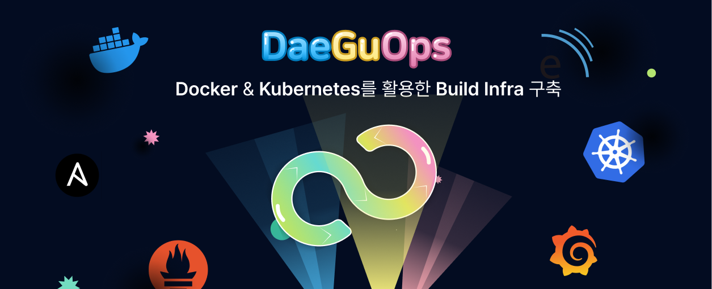

# 🛠️ Docker & Kubernetes를 활용한 Build Infra 구축 🛠️

#### 🏆 삼성 청년 SW 아카데미(SSAFY): 삼성전자 VD사업부 연계 프로젝트

2023.02.20 ~ 2023.04.07 (46일)

### 📜 Contents

1.  [Overview](#-overview)
2.  [서비스 화면](#-서비스-화면)
3.  [사용 설명서](#-사용-설명서)
4.  [개발 환경](#-개발-환경)
5.  [기술 특이점](#-기술-특이점)
6.  [기획 및 설계](#-기획-및-설계)
7.  [팀 소개](#-팀-소개)

## 👀 Overview

다양한 언어(Java, C, C#)에 대응하여 엄격한 소스코드 정적 검사를 통해 신뢰성 있는 빌드 환경과 서버 상태에 대한 관리 기능 및 시각화된 자료를 제공해주는 서비스입니다.

## 💻 서비스 화면

### Plugin을 통하여 Job 생성

- 팀 DaeGuOps에서 직접 제작한 Plugin을 이용하여 Job을 생성할 수 있습니다.

### 빌드 실행 및 결과물

- 생성된 Job을 이용하여 빌드를 실행합니다.

- 빌드가 Check Commit Hash에서 실패한다면 해당 커밋에 대하여 사전에 빌드를 진행한 적이 있는 경우입니다.

### SonarQube 검사 결과

- 빌드가 성공적으로 이루어졌다면 SonarQube 검사 결과에 대한 정보를 확인할 수 있습니다.

### Grafana를 통한 서버 모니터링

- 모니터링 페이지를 이용하여 각 서버들의 상태를 확인할 수 있습니다.

## 📋 사용 설명서

- [DaeGuOps\_사용설명서](https://lab.ssafy.com/s08-s-project/S08P21S003/-/blob/master/exec/porting_manual.md)

## 👨‍💻 개발 환경

- CI/CD

  - Docker `20.10.21`
  - Jenkins `2.387.1`
  - Ansible `core 2.12.10`
  - Kubernetes `v1.26.3`

- Monitoring System

  - Grafana `v6.40.4`
  - Prometheus `2.43.0`

- OS

  - Ubuntu `20.04`

- IDE

  - IntelliJ
  - VSCode

- Server

  - AWS EC2
  - Nginx

- Management Tool

  - 형상 관리 : Gitlab
  - 이슈 관리 : Jira
  - 커뮤니케이션 : Mattermost, Webex, Notion

## 💡 기술 특이점

- 다양한 언어(Java, C, C#)에 대한 일관된 빌드 환경 제공
- SonarQube를 이용한 소스코드 정적 검사로 코드의 품질 검증 자동화
- 동시다발적인 빌드 요청에 대하여 priority를 통한 효율적인 분산 처리 수행
- Kubernetes를 통하여 클러스터 내 워커노드 관리 및 복구
- Ansible playbook과 Jenkins CLI를 이용하여 빌드 Pipeline 뿐만 아니라 신규 빌드 서버에 대한 초기 설정까지 자동화
- Grafana & Prometheus를 이용하여 빌드 서버 모니터링 및 시각화

## 🛠️ 기획 및 설계

### ✒️ 요구사항 정의 및 기능 명세

### 🎨 아키텍처 구성도

## 📂 프로젝트 산출물

- [프로젝트 기획서](https://lab.ssafy.com/s08-s-project/S08P21S003/-/blob/master/docs/daeguops_proposal.md)
- [기능 명세서](https://lab.ssafy.com/s08-s-project/S08P21S003/-/blob/master/docs/daeguops_function_specification.md)
- [간트 차트](https://lab.ssafy.com/s08-s-project/S08P21S003/-/blob/master/docs/daeguops_gantt_chart.md)
- [플로우 차트](https://lab.ssafy.com/s08-s-project/S08P21S003/-/blob/master/docs/daeguops_flow_chart.md)
- [아키텍처 구성도](https://lab.ssafy.com/s08-s-project/S08P21S003/-/blob/master/docs/daeguops_architecture_diagram.md)
- [시퀀스 다이어그램](https://lab.ssafy.com/s08-s-project/S08P21S003/-/blob/master/docs/daeguops_sequence_diagram.md)
- [최종 발표 PPT](https://lab.ssafy.com/s08-s-project/S08P21S003/-/blob/master/docs/daeguops_final.pdf)

## 🦹‍ 팀 소개

### 👨‍👩‍👦‍👦 DaeGuOps (Daejeon + Gumi + DevOps)

|                                          임영묵                                           |                                          김성태                                           |                                          김성한                                           |                                          양희제                                           |                                           장재욱                                           |                                          한상우                                           |
| :---------------------------------------------------------------------------------------: | :---------------------------------------------------------------------------------------: | :---------------------------------------------------------------------------------------: | :---------------------------------------------------------------------------------------: | :----------------------------------------------------------------------------------------: | :---------------------------------------------------------------------------------------: |
|                     [Youngmook Lim](https://github.com/Youngmook-Lim)                     |                        [Seongtae Kim](https://github.com/joykst96)                        |                         [Sunghan Kim](https://github.com/s-ggul)                          |                        [Heeje Yang](https://github.com/HeeJeYang)                         |                         [Jaeuk Jang](https://github.com/jaeukjang)                         |                       [Sangwoo Han](https://github.com/miracle3070)                       |
|  |  |  |  |  |  |

## 📐 팀원 역할

- **임영묵 (팀장)**

  - Jenkins Pipeline 총괄
  - 언어/빌드 별 스크립트 모듈화
  - SonarQube를 활용한 코드 정적분석 및 결과 페이지 제작 자동화

- **김성태**

  - 전체 아키텍처 설계 및 구성
  - Ansible Node 추가/삭제 기능 구현
  - Pipeline의 Build Stage 작성
  - Build용 컨테이너 제작

- **김성한**

  - Jenkins Plugin(Pipeline Generator) 개발
  - 각 서버 Node Exporter 구성
  - Grafana & Prometheus 연동을 통한 서버 모니터링

- **양희제**

  - Kubernetes 활용한 인프라 구성
  - Ansible script를 통한 초기 세팅

- **장재욱**

  - AWS 인스턴스 관리
  - Jenkins Plugin(Pipeline Generator) 개발
  - Grafana & Prometheus 연동을 통한 서버 모니터링

- **한상우 (발표자)**
  - 동일 Build 요청 감지 로직
  - Job별 우선순위 부여 로직

